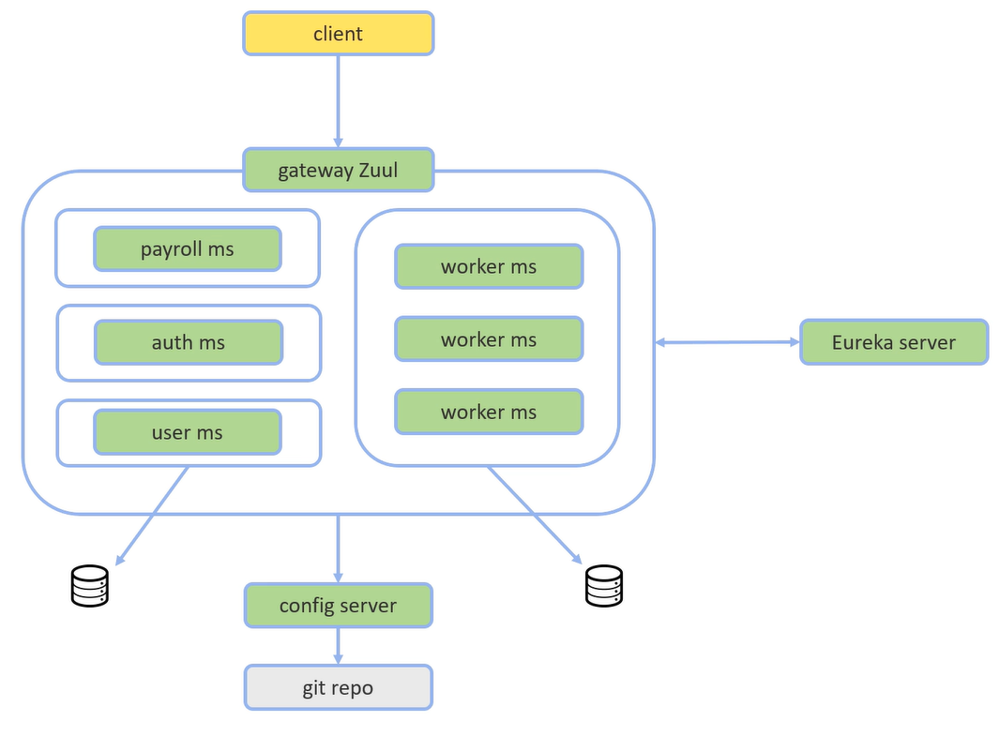

## 💻 Curso: Microsserviços Java com Spring Boot e Spring Cloud
- Código desenvolvido durante o curso "Microsserviços Java com Spring Boot e Spring Cloud" da Udemy - Prof. Nélio Alves
## :books: Conteúdos
- [Spring Cloud Netflix](https://spring.io/projects/spring-cloud-netflix) incluindo: 
  - Feign para requisições de API entre microsserviços
  - Ribbon para balanceamento de carga
  - Servidor Eureka para registro dos microsserviços
  - API Gateway Zuul para roteamento e autorização
  - Hystrix para tolerância a falhas
- OAuth e JWT para autenticação e autorização
- Servidor de configuração centralizada com dados em repositório Git
- Geração de containers Docker para os microsserviços e bases de dados

## :whale: Utilização com Docker
- Para utilizar com containers, basta fazer o build de cada um dos microsserviços, e logo após, fazer o build de cada imagem.
- Os microsserviços configurados para utilizar em ambiente docker estão nesta [branch](https://github.com/rodrigo-lucio/curso-microsservicos-java-spring-boot-cloud/tree/docker) 
- Os arquivos das imagens e comandos para rodar os containers também encontram-se nesta branch específica.

## :office: A aplicação:
<h1 align="center">
    
</h1>
